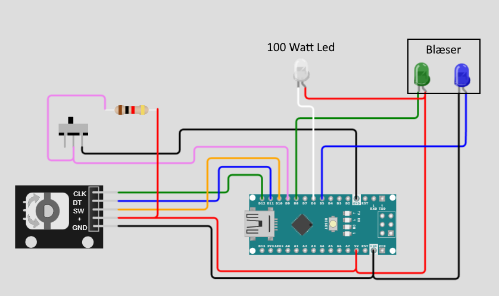

# Tjommy-lygten

## Pins-overview
| Pin | Navn          |
| --- | ------------- |
| D8  | Fan-Power     |
| D5  | Fan-PWM       |
| D6  | LED-Power/PWM | 



LED-Grøn skal være LOW for at aktivere blæseren.
LED-Blå skal styre blæser-hastigheden med et PWM-signal (0 er slukket, 255 er tændt). 

LED-Hvid skal styres med (255 er slukket, 0 er tændt).

[Rotary Encoder'en](https://docs.wokwi.com/parts/wokwi-ky-040) skal som udgangspunkt styre lysstyrken på LEDen (PWM). Men ved et klik, skal den skifte til at styre hastigheden på blæseren. Evt. en LED som lyser efter tilstanden?

## Originale specifikationer
> Den blå og grønne LED skal forstille blæseren der køler LEDen.
> 
> Den grønne LED skal være LOW for at tænde blæseren, og den blå skal man bruge PWM for at skifte på blæserens hastighed.
> 
> For at tænde 100 watt LED så skal den være LOW og der kan bruges pwm (255 svare til at være helt slukket og 0 svare til at være helt tændt)
> 
> ### Regler:
> 1. Den blå LED (PWM til blæser) må kun køre når den grønne LED (POWER til blæser) er tændt.
> 2. Man skal bruge switchen til at tænde og slukke for både blæseren og LEDen.
> 3. Når man drejer på Rotary Encoder'en så skruer man på og ned for lysstyrken på LEDen.
> 4. Når man trykker på Rotary Encoder'en så skifter man til at styre hastigheden på blæseren.

# Wokwi
[Wokwi](https://wokwi.com/projects/new/arduino-nano)

```json
{
  "version": 1,
  "author": "Anonymous maker",
  "editor": "wokwi",
  "parts": [
    { "type": "wokwi-arduino-nano", "id": "nano", "top": 30.37, "left": 86.05, "attrs": {} },
    { "type": "wokwi-ky-040", "id": "encoder1", "top": 20.11, "left": -171.27, "attrs": {} },
    {
      "type": "wokwi-led",
      "id": "led1",
      "top": -131.2,
      "left": 130.34,
      "attrs": { "color": "white" }
    },
    {
      "type": "wokwi-led",
      "id": "led2",
      "top": -126.17,
      "left": 264.68,
      "attrs": { "color": "green" }
    },
    { "type": "wokwi-slide-switch", "id": "sw1", "top": -56.95, "left": -121.58, "attrs": {} },
    {
      "type": "wokwi-resistor",
      "id": "r1",
      "top": -74.81,
      "left": -70.33,
      "attrs": { "value": "1000" }
    },
    {
      "type": "wokwi-led",
      "id": "led3",
      "top": -125.29,
      "left": 310.49,
      "attrs": { "color": "blue" }
    }
  ],
  "connections": [
    [ "encoder1:GND", "nano:GND.1", "black", [ "h104.43", "v58.38", "h175.88" ] ],
    [ "encoder1:VCC", "nano:5V", "red", [ "h111.06", "v59.94", "h4.59" ] ],
    [ "encoder1:CLK", "nano:12", "green", [ "h123.29", "v-19.74", "h34.67" ] ],
    [ "encoder1:DT", "nano:11", "blue", [ "h112.59", "v-38.41", "h50.98" ] ],
    [ "encoder1:SW", "nano:10", "orange", [ "h99.84", "v-57.7", "h78" ] ],
    [ "sw1:2", "nano:9", "violet", [ "v17.97", "h135.37", "v-18.35", "h100.94" ] ],
    [ "sw1:3", "nano:GND.2", "black", [ "v7.26", "h109.55", "v-27.02", "h199.33" ] ],
    [ "encoder1:VCC", "r1:2", "red", [ "h0" ] ],
    [ "r1:1", "sw1:2", "violet", [ "v-15.12", "h-64.03", "v72.9", "h28.04" ] ],
    [ "nano:8", "led2:C", "green", [ "v-90.62", "h128.81" ] ],
    [ "nano:6", "led1:C", "white", [ "v-103.87", "h-14.78" ] ],
    [ "led1:A", "led2:A", "red", [ "v11.83", "h39.6" ] ],
    [ "led2:A", "nano:5V", "red", [ "v202.56", "h-20.82" ] ],
    [ "led3:A", "nano:5", "blue", [ "v40.58", "h-0.36", "v18.86", "h-156.5" ] ],
    [ "led3:C", "nano:GND.1", "black", [ "v208.3", "h-27.54" ] ]
  ]
}
```